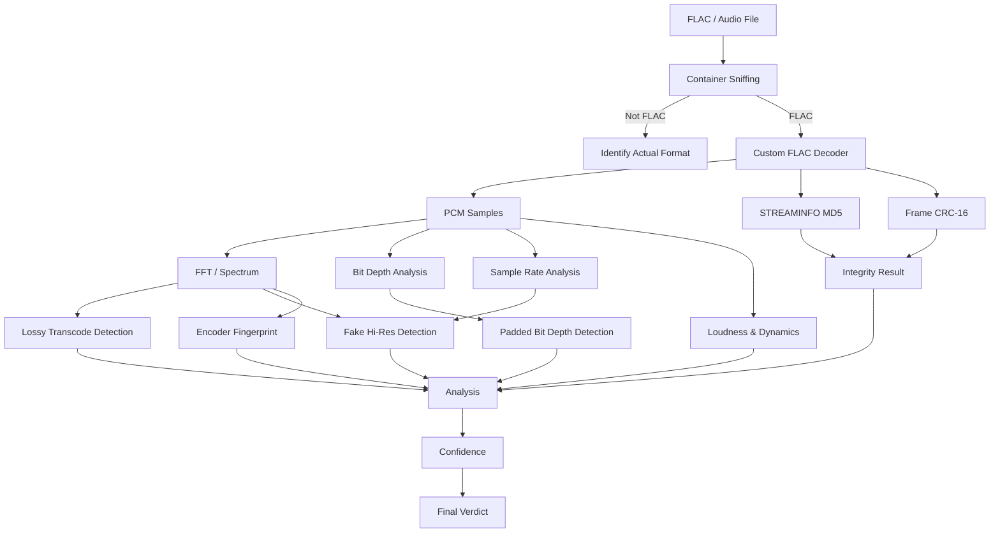

# SpectroFlac

<p align="center">
  
</p>

<h3 align="center">Is this FLAC really lossless?</h3>

<p align="center">
  An offline Android analyzer that looks beyond the file extension.
  <br>
  Decode it. Analyze it. Verify it.
</p>

<p align="center">
  <a href="https://github.com/LinuxKernel44/SpectroFlac/releases">
    
  </a>
  <a href="https://github.com/LinuxKernel44/SpectroFlac">
    
  </a>
  
  
  
</p>

<p align="center">
  
  
  
  
  
</p>

---

## What is SpectroFlac?

**SpectroFlac** is an Android application designed to answer a deceptively simple question:

> **Is this FLAC actually lossless?**

A `.flac` extension alone doesn't tell you where the audio came from.

A file can be:

* a genuine lossless master;
* an MP3/AAC/Vorbis transcode wrapped in FLAC;
* a fake 96/192 kHz file containing only 44.1/48 kHz content;
* a 24-bit container containing only 16-bit samples;
* corrupted;
* or even an MP3 renamed to `.flac`.

SpectroFlac decodes the audio **on-device**, analyzes the complete spectrum and reports the evidence behind its verdict.

```text
GENUINE  96%

24 BIT  44.1KHZ  1616 KBPS FLAC
```

Instead of simply saying *"lossless"* or *"lossy"*, SpectroFlac provides the measurements used to reach its conclusion.

---

## ✨ Features

* 🔬 **Full-spectrum analysis**
* 🎵 **Lossy transcode detection**
* 📈 **Fake hi-res detection**
* 🧬 **Bit-depth analysis**
* 🔐 **FLAC MD5 verification**
* 🧮 **Frame CRC-16 verification**
* 📊 **RMS / peak / crest factor**
* 📉 **Clipping detection**
* 🎚️ **TT-style DR estimation**
* 🧾 **Encoder fingerprints**
* 🏷️ **Metadata and tags**
* 🖼️ **Embedded cover art**
* 📁 **Recursive folder scanning**
* 📤 **CSV / JSON export**
* 🕘 **Local analysis history**
* 📱 **Android share-sheet integration**
* 🪟 **Liquid glass UI**
* 🔒 **100% offline**
* 🚫 **No network access**
* 🚫 **No special permissions**

---

## 📱 Screenshots

|                        Home                       |                     Transcode detected                    |
| :-----------------------------------------------: | :-------------------------------------------------------: |
|  |  |

|                         Genuine file                         |                        History                       |
| :----------------------------------------------------------: | :--------------------------------------------------: |
|  |  |

---

## 🧪 What it detects

| Check                | Method                                                               |
| -------------------- | -------------------------------------------------------------------- |
| **Lossy transcode**  | Peak-hold FFT across the entire track and spectral cutoff analysis   |
| **Encoder profile**  | Measured cutoff compared against known lossy encoder characteristics |
| **Fake hi-res**      | Detects content limited to the Nyquist range of lower sample rates   |
| **Padded bit depth** | Detects 24-bit containers whose lower 8 bits are consistently zero   |
| **Invalid FLAC**     | Container sniffing identifies files based on their actual contents   |
| **Corruption**       | STREAMINFO MD5 and FLAC frame CRC-16 verification                    |
| **Loudness**         | RMS and sample peak measurements                                     |
| **Dynamics**         | Crest factor and TT-style DR estimation                              |
| **Clipping**         | Sample-level clipping and consecutive clipped runs                   |

### Example

A file claiming to be:

```text
24-bit / 96 kHz
```

might actually contain:

```text
16-bit / 44.1 kHz
```

SpectroFlac can identify evidence of both conditions rather than trusting the metadata.

---

## 🧠 How the analysis works



The important distinction is that SpectroFlac does **not** rely solely on metadata.

The audio itself is decoded and measured.

---

## 🔬 Spectral analysis

Lossy encoders commonly introduce a characteristic high-frequency cutoff.

SpectroFlac performs a **peak-hold FFT over the complete track** and examines the resulting spectrum.

For example, approximate encoder profiles can look like:

```text
128 kbps  ────────────────╮
                          ╰──── cutoff

192 kbps  ───────────────────────╮
                                 ╰── cutoff

320 kbps  ───────────────────────────────╮
                                        ╰─ cutoff
```

The measured cutoff is then compared with known encoder characteristics.

This can provide strong evidence that a supposedly lossless file originated from a lossy source.

---

## ⚠️ Important limitations

SpectroFlac is an **analysis tool, not a magic provenance detector**.

A genuinely dull master and a lossy transcode can sometimes produce similar spectra, especially when the cutoff is gradual.

Likewise, a lossy source can sometimes be made harder to identify through:

* upsampling;
* filtering;
* resampling;
* additional processing;
* multiple generations of transcoding.

For this reason, SpectroFlac reports a **confidence value and the measurements behind it** instead of pretending that spectral analysis can prove the origin of every file.

> **The spectral test is strong evidence, not proof.**

---

## 🪟 Liquid Glass UI

SpectroFlac uses a custom **liquid glass interface**.

On Android 13+, panels use **AGSL runtime shaders** to refract the animated background behind them.

The effect includes:

* glass-like refraction;
* animated backgrounds;
* chromatic dispersion;
* translucent panels;
* dynamic lighting;
* shader-based distortion.

On Android 10–12, the application falls back to a frosted-glass presentation while keeping the same interface and functionality.

---

## 🛠️ Tech Stack

| Layer                 | Technology                 |
| --------------------- | -------------------------- |
| **Language**          | Kotlin                     |
| **UI**                | Jetpack Compose            |
| **Graphics**          | AGSL Runtime Shaders       |
| **Database**          | Room                       |
| **Audio decoder**     | Custom Kotlin FLAC decoder |
| **Signal processing** | FFT / spectral analysis    |
| **Serialization**     | JSON                       |
| **Build system**      | Gradle + Kotlin DSL        |
| **File access**       | Storage Access Framework   |
| **Minimum Android**   | Android 10 / API 29        |
| **Modern graphics**   | Android 13 / API 33+       |

### Built with

<p align="center">
  
</p>

<p align="center">
  <b>Kotlin</b> · <b>Jetpack Compose</b> · <b>AGSL</b> · <b>Room</b> · <b>FFT</b> · <b>Custom FLAC Decoder</b>
</p>

---

## 🏗️ Architecture

```text
app/src/main/java/com/spectroflac/
│
├── flac/
│   ├── BitInput
│   ├── Container sniffing
│   ├── FLAC bitstream parsing
│   └── Full FLAC decoder
│
├── analysis/
│   ├── FFT
│   ├── Streaming measurements
│   ├── Spectral analysis
│   ├── Dynamics analysis
│   └── Verdict engine
│
├── data/
│   ├── Room database
│   └── JSON serialization
│
├── export/
│   ├── Text reports
│   ├── CSV
│   ├── JSON
│   └── Share intents
│
└── ui/
    ├── Compose screens
    └── glass/
        └── AGSL liquid glass system
```

---

## 🎧 Why a custom FLAC decoder?

SpectroFlac intentionally does **not** delegate FLAC decoding to `MediaCodec`.

The platform decoder may return 16-bit PCM on some devices.

That would make important parts of the analysis unreliable.

For example:

```text
24-bit FLAC
     │
     ▼
Platform decoder
     │
     ▼
16-bit PCM
     │
     └── ❌ Original bit depth is already lost
```

SpectroFlac instead performs its own decoding:

```text
24-bit FLAC
     │
     ▼
Custom Kotlin decoder
     │
     ▼
Original PCM samples
     │
     ├──► Bit-depth analysis
     ├──► FFT
     ├──► Dynamics
     └──► MD5 verification
```

This allows the application to inspect the decoded samples without depending on device-specific audio decoder behavior.

---

## 📂 Using SpectroFlac

### Analyze a file

Select any file through the Android file picker.

SpectroFlac will determine whether the file is actually a FLAC stream.

An MP3 renamed to:

```text
song.flac
```

will not be treated as a valid FLAC.

---

### Scan a folder

Select a directory and SpectroFlac recursively analyzes its `.flac` files.

Results include:

* total files;
* genuine files;
* suspicious files;
* invalid files;
* analysis statistics;
* CSV export;
* JSON export.

---

### Share to SpectroFlac

SpectroFlac registers itself for FLAC files.

You can therefore use:

```text
Share → SpectroFlac
```

or:

```text
Open with → SpectroFlac
```

directly from compatible file managers.

---

### History

Every analysis can be stored locally using **Room**.

Previous reports can be:

* reopened;
* inspected;
* exported;
* compared manually.

No account or cloud service is required.

---

## 🔒 Privacy

SpectroFlac is designed to work entirely offline.

```text
┌─────────────────────────────┐
│        Your device          │
│                             │
│  FLAC ──► Decode ──► FFT    │
│             │        │      │
│             ▼        ▼      │
│           MD5      Verdict  │
│                             │
└─────────────────────────────┘
             │
             X
        No network
```

### SpectroFlac does not require:

* ❌ Internet access
* ❌ User accounts
* ❌ Cloud processing
* ❌ Audio uploads
* ❌ Special storage permissions

Files are accessed through Android's **Storage Access Framework** and analyzed locally.

---

## 🏭 Building

Clone the repository:

```bash
git clone https://github.com/LinuxKernel44/SpectroFlac.git
cd SpectroFlac
```

Build the debug APK:

```bash
./gradlew :app:assembleDebug
```

The APK will be generated at:

```text
app/build/outputs/apk/debug/
```

Run the unit tests:

```bash
./gradlew :app:testDebugUnitTest
```

---

## 🔐 Signed release

Signing material is never committed to the repository.

Create a keystore:

```bash
keytool -genkeypair -v \
    -keystore spectroflac.jks \
    -alias spectroflac \
    -keyalg RSA \
    -keysize 4096 \
    -validity 10000
```

Create `keystore.properties` in the project root:

```properties
storeFile=/absolute/path/to/spectroflac.jks
storePassword=YOUR_PASSWORD
keyAlias=spectroflac
keyPassword=YOUR_PASSWORD
```

Both files are excluded through `.gitignore`.

Build the release:

```bash
./gradlew :app:assembleRelease
```

Without `keystore.properties`, the release build still works but produces an unsigned APK.

---

## 🚀 Publishing a release

The repository includes an automated release script:

```bash
scripts/release.sh
```

The script:

1. Reads `versionName` from `app/build.gradle.kts`
2. Builds the release APK
3. Verifies the APK signature
4. Creates or updates the corresponding GitHub release
5. Attaches the signed APK

Before releasing, update:

```text
versionCode
versionName
```

The resulting GitHub release follows:

```text
vX.Y.Z
```

---

## 🧪 Testing

The FLAC decoder is tested against the **MD5 checksum stored inside the FLAC STREAMINFO block**.

This provides a strong end-to-end validation of the decoded audio.

Detection thresholds are also tested against samples with known provenance.

Set a sample directory:

```bash
SPECTROFLAC_SAMPLES=/path/to/samples \
./gradlew :app:testDebugUnitTest
```

The test suite expects:

```text
real_*.flac → genuine
fake_*.flac → non-genuine
```

---

## 🧪 Generating test samples

Using FFmpeg:

```bash
ffmpeg \
    -f lavfi \
    -i "anoisesrc=r=44100:duration=20:color=pink" \
    -ar 44100 \
    -sample_fmt s16 \
    -c:a flac \
    real_16_44.flac
```

Create a lossy intermediate:

```bash
ffmpeg \
    -i real_16_44.flac \
    -c:a libmp3lame \
    -b:a 128k \
    t.mp3
```

Convert it back to FLAC:

```bash
ffmpeg \
    -i t.mp3 \
    -ar 44100 \
    -sample_fmt s16 \
    -c:a flac \
    fake_mp3_128.flac
```

This produces a FLAC container whose audio originated from a 128 kbps MP3.

---

## 📊 Example verdict

```text
┌──────────────────────────────────────┐
│                                      │
│             GENUINE                  │
│               96%                    │
│                                      │
│       24 BIT · 44.1 KHZ              │
│             1616 KBPS                │
│                                      │
├──────────────────────────────────────┤
│                                      │
│  Spectrum       ✓ No obvious cutoff  │
│  Bit depth     ✓ Genuine 24-bit     │
│  Sample rate   ✓ 44.1 kHz content   │
│  STREAMINFO    ✓ MD5 valid           │
│  Frames        ✓ CRC valid           │
│  Clipping      ✓ None detected       │
│                                      │
└──────────────────────────────────────┘
```

The application exposes the measurements behind the verdict rather than hiding them behind a single boolean.

---

## 🗺️ Roadmap

### Planned

* [ ] Full interactive spectrogram
* [ ] Pinch-to-zoom
* [ ] Spectrogram panning
* [ ] Frequency cursor
* [ ] Per-channel spectrum
* [ ] Stereo correlation
* [ ] Joint-stereo artifact analysis
* [ ] Additional encoder fingerprints
* [ ] More detailed spectral visualizations

The analysis engine already produces much of the data required for the interactive spectrogram; the current UI displays a preview strip.

---

## 📜 Disclaimer

SpectroFlac cannot determine the complete historical provenance of an audio file with certainty.

Its verdict is based on measurable characteristics of the file and decoded audio.

A file that has been heavily processed, filtered, resampled, or transcoded multiple times may not retain obvious evidence of its source.

**Use the confidence score and underlying measurements as evidence, not absolute proof.**

---

## 👨‍💻 Author

**LinuxKernel44**

GitHub:
https://github.com/LinuxKernel44

---

## 📄 License

See [`LICENSE`](LICENSE) for the license applicable to this project.

---

<p align="center">
  <b>SpectroFlac</b>
  <br>
  <sub>Decode it. Analyze it. Verify it.</sub>
</p>
