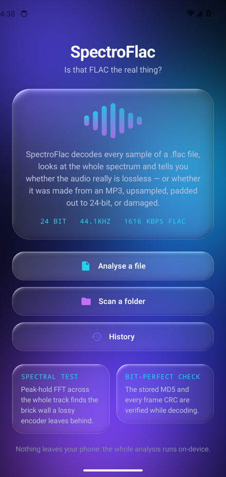
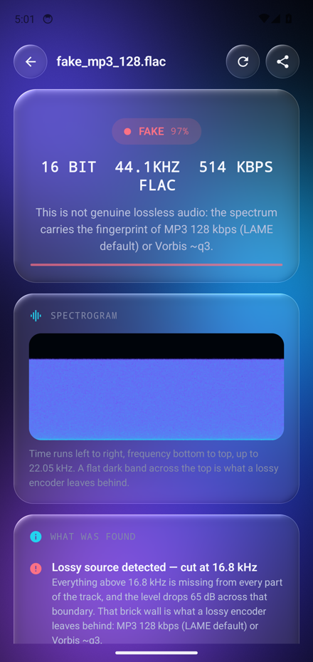
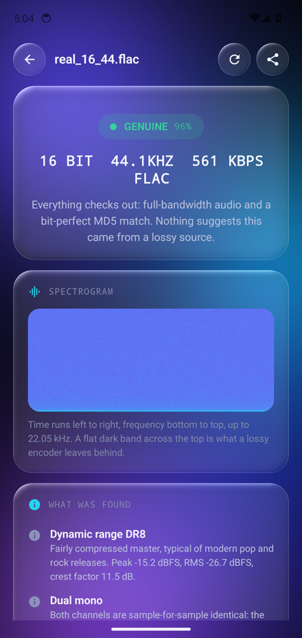
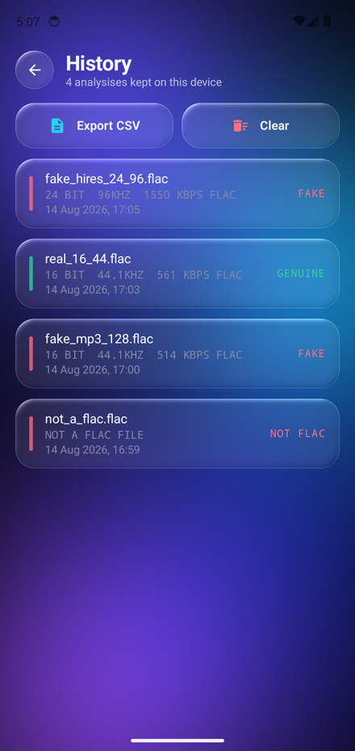

# SpectroFlac

An Android app that answers one question about a `.flac` file: **is this really lossless?**

It decodes every sample on device, looks at the whole spectrum, and reports what it finds:

```
GENUINE  96%
24 BIT  44.1KHZ  1616 KBPS FLAC
```

Along with the verdict it gives the full picture — technical details, the spectral reasoning that
led to the verdict, MD5/CRC integrity, levels and dynamics, encoder fingerprints, tags and cover.

| Home | Transcode caught | Genuine file | History |
| --- | --- | --- | --- |
|  |  |  |  |

The whole interface is liquid glass: on Android 13+ every panel is an AGSL lens that refracts the
animated backdrop behind it, with chromatic dispersion at the rim.

## What it detects

| Check | How |
| --- | --- |
| **Lossy transcode** (MP3/AAC/Vorbis re-encoded as FLAC) | Peak-hold FFT across the whole track; a lossy encoder leaves a brick wall of ≥26 dB and nothing above it. The measured cut is matched against known encoder profiles (128 kbps ≈ 16 kHz, 320 kbps ≈ 20 kHz…). |
| **Fake hi-res** | A 96 kHz file whose content stops at the Nyquist limit of 44.1/48 kHz was upsampled; the extra rate carries no information. |
| **Padded bit depth** | If the bottom 8 bits of every sample are zero, a "24-bit" file is 16-bit audio in a bigger container. |
| **Not a FLAC at all** | The container is sniffed from its first bytes, so an MP3 renamed `.flac` is named for what it is. |
| **Damage** | The MD5 stored in `STREAMINFO` is recomputed from the decoded audio, and every frame CRC-16 is verified. |
| **Loudness / clipping** | Sample peak, RMS, crest factor, clipped runs and a TT-style DR value. |

### What it cannot tell you

A genuinely dull master and a transcode can look alike if the cut is gradual — that is why the app
reports a *confidence* and shows its measurements instead of only a yes/no. A file that was decoded
from a lossy source and then upsampled or filtered can also hide its origins. The spectral test is
strong evidence, not proof.

## Requirements

- Android 10 (API 29) or newer.
- The liquid glass refraction needs **Android 13** (AGSL runtime shaders); below that the app falls
  back to a frosted glass look with the same layout.
- No permissions and no network access: files are read through the Storage Access Framework and
  everything is analysed on device.

## Using it

- **Analyse a file** — pick any file; if it is not a FLAC stream, the app says so.
- **Scan a folder** — walks the whole tree and analyses every `.flac`, with per-verdict counters and
  CSV/JSON export.
- **Share to SpectroFlac** — the app appears in the share sheet and in "Open with" for FLAC files.
- **History** — every analysis is kept locally (Room) and can be re-opened or exported.

## Building

```bash
./gradlew :app:assembleDebug          # APK in app/build/outputs/apk/debug/
./gradlew :app:testDebugUnitTest      # decoder and detection tests
```

### Signed release

Signing material is never committed. Create a keystore and a `keystore.properties` at the project
root (both are in `.gitignore`):

```properties
storeFile=/absolute/path/to/spectroflac.jks
storePassword=…
keyAlias=spectroflac
keyPassword=…
```

```bash
keytool -genkeypair -v -keystore spectroflac.jks -alias spectroflac \
        -keyalg RSA -keysize 4096 -validity 10000
./gradlew :app:assembleRelease
```

Without `keystore.properties` the release build still works, it simply comes out unsigned.

## Tests

The decoder is checked against the MD5 that the encoder stored inside each file — the strongest
correctness check a decoder can get — and the detection thresholds are checked against files of
known provenance.

```bash
# any directory of .flac files; names starting with real_ must come out genuine, fake_ must not
SPECTROFLAC_SAMPLES=/path/to/samples ./gradlew :app:testDebugUnitTest
```

Samples can be generated with ffmpeg, for example:

```bash
ffmpeg -f lavfi -i "anoisesrc=r=44100:duration=20:color=pink" -ar 44100 -sample_fmt s16 \
       -c:a flac real_16_44.flac
ffmpeg -i real_16_44.flac -c:a libmp3lame -b:a 128k t.mp3
ffmpeg -i t.mp3 -ar 44100 -sample_fmt s16 -c:a flac fake_mp3_128.flac
```

## How it is put together

```
app/src/main/java/com/spectroflac/
├── flac/          FLAC bitstream: BitInput, container sniffing, full decoder (no MediaCodec)
├── analysis/      FFT, streaming measurements, the Judge that turns numbers into a verdict
├── data/          Room history + JSON serialisation of a report
├── export/        text report, CSV, JSON, share intents
└── ui/            Compose screens, and glass/ — the AGSL liquid glass system
```

The FLAC decoder is written from scratch in Kotlin rather than delegating to `MediaCodec`: the
platform decoder hands back 16-bit PCM on many devices, which would make both the MD5 check and the
"is this really 24-bit?" test meaningless.

## Roadmap

- Full interactive spectrogram (pinch zoom, pan, frequency cursor) — the analysis already produces
  the data, the current screen shows a preview strip.
- More statistics: per-channel spectra, stereo correlation, joint-stereo artefacts.
